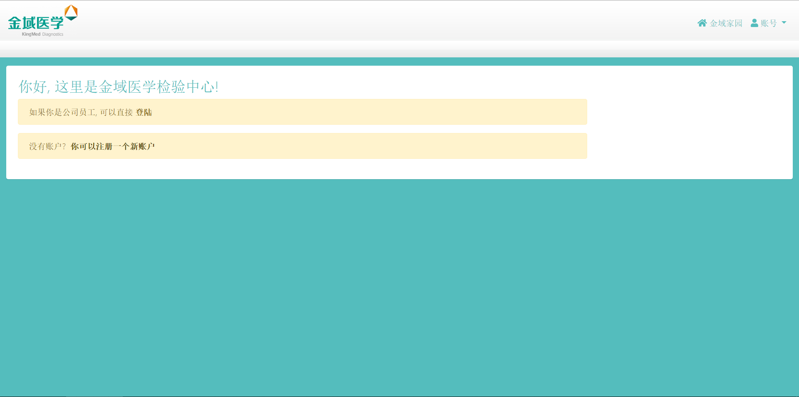
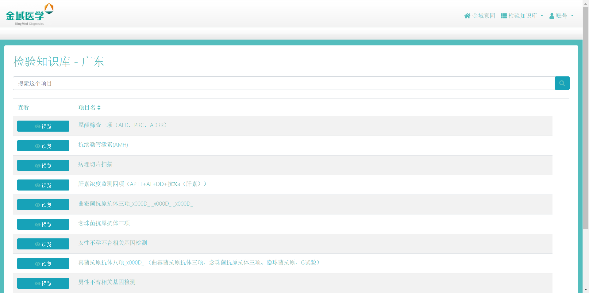
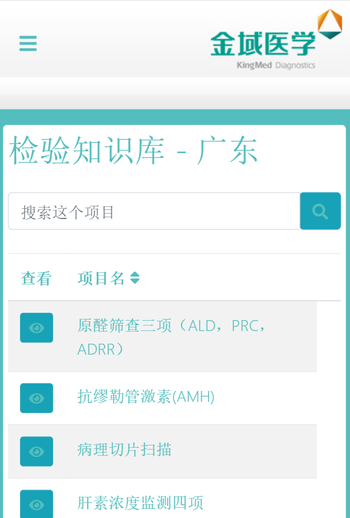
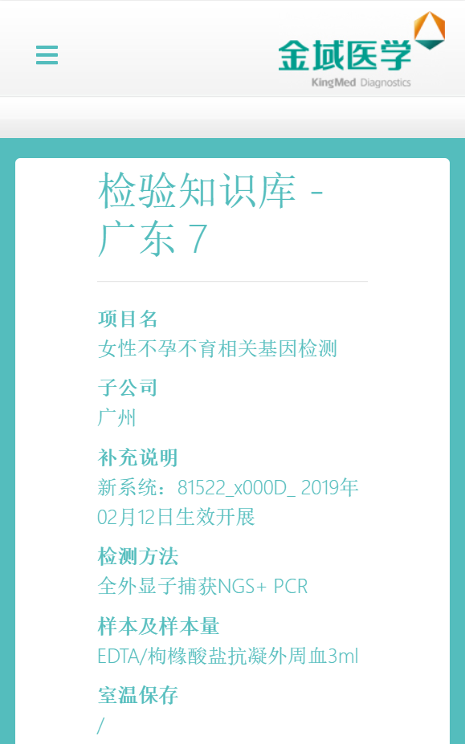
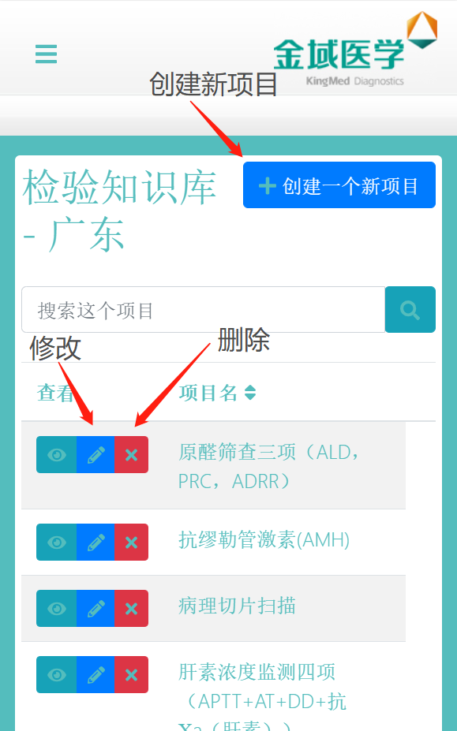
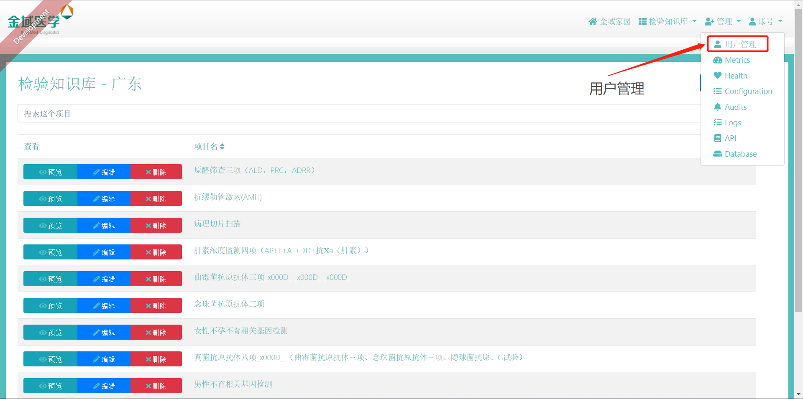
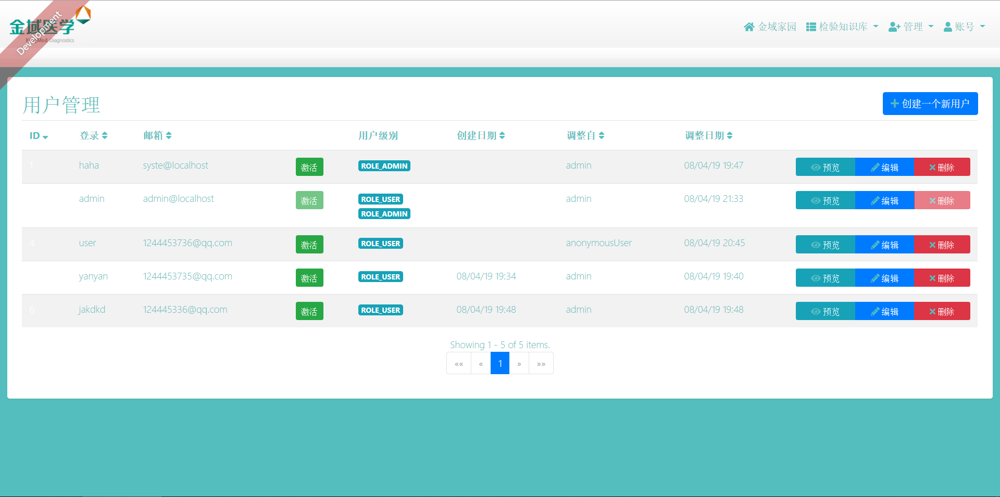
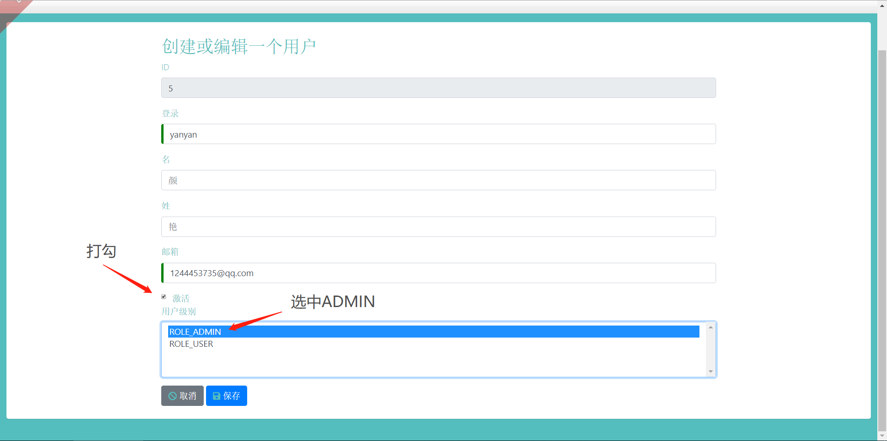

# 金域检验知识库 0.0.1 版本特性

## 前端界面PC端移动端完美适配

电脑端:

手机端:

UI设计风格简约流畅, 和公司logo配色暗合, 以蓝绿色和白色为主题, 彰显简约却不简单的从容格调。

## 基于Elastic Search的全局关联搜索, 更准更快

基于`Mysql`数据库储存, 基于`Elastic Search`搜索引擎的检验知识库, 让数千个表单在一秒内呈现, 你再也不需按照项目名检索, 或按照临床应用检索, 只有一个搜索框, 搜索所有你想要的内容。

数千项目, 分页呈现。

点击`预览按钮` 查看更多详情:

## 用户分级, 管理员后台管理

用户分两类, 一类是普通用户, 一类是管理员, 用管理员账号登录, 会有更多的`管理`功能选项, 会看到普通用户看不到的`权限`, 身为管理员, 你可以创建或更改知识库:

管理员修改/删除/添加的内容, 能够第一时间被其他所有人看到, 换句话说, 管理员直接将数据库中的数据进行了修改。

不仅如此，管理员还可以对所有注册用户的信息进行修改/添加/删除，点击目录中的`图标`, 选择`用户管理`。

进入管理页面:

需要着重强调的是`用户级别`, 我们看到`admin`账号同时拥有`ROLE_USER`和`ROLE_ADMIN`两种级别, 说明该账号及时用户, 也是管理员, 而其他的用户只是普通用户, 事实上, 也只有管理员才能看到这个页面。

如果管理员需要将其他人也设定为管理员, 可以点击`编辑`, 比如我要将用户名为`yanyan`的账号升级为`管理员`, 那么就在`yanyan`所在的列表里点击右端的编辑选项。

